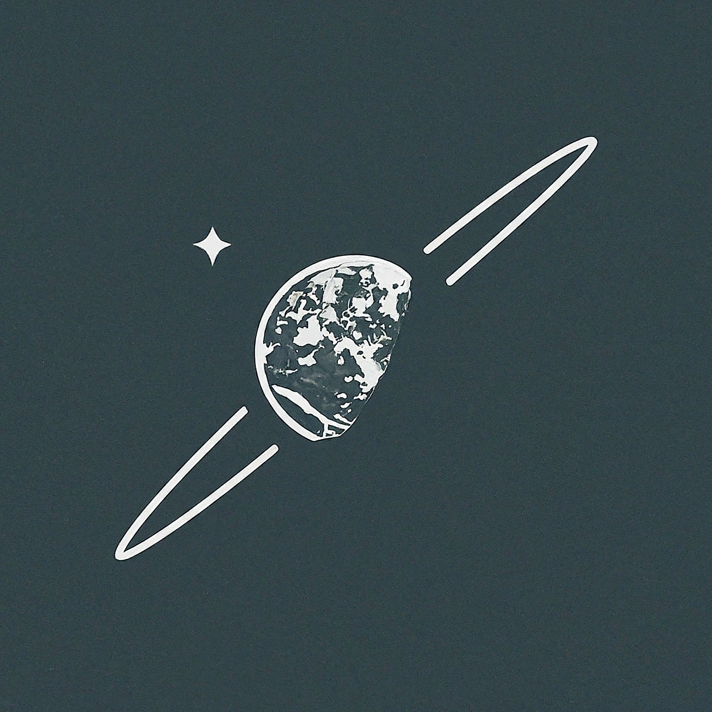

# Sat-Sight

</img>

### A satellite star tracking suite of tools

> - Star database manipulation and projections
>    - Gnomonic projection
>    - (*planned*) Orthogonal projection
>    - (*planned*) Stereographic projection
>    - Quaternion Rotation
> - Image identification using "blur and prick" method
> - (*planned*) Star object follow for realtime tracking

 
## Blur and Prick method
This is a low computation high memory access operation. 

### Step 1:

*image is a render from [sat-sight-view](https://github.com/dj-ryan/sat-sight-view)*

Increase the raw image contrast and calculate a gausen blur over the image.

